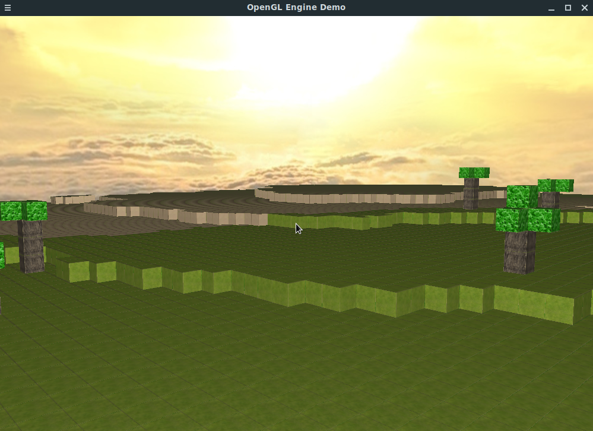

<h2>OpenGL Voxel Engine</h2>
<h3>Description</h3>
Simple 3D-Voxel-Engine in Modern OpenGL, created from scratch as a project to practice C++ and 3D-Graphic-Programming.  
Open source game assets (textures etc.) are credited in credits.txt files in their respective directories.
 
 

<h4>Features:</h4>
- Move in 3D-Space with WASD and Mouse  
- Texture loading  
- Support for Phong lighting with specular maps  
- Skyboxes  
- Terrain generation using Perlin Noise  
- Chunking  
- Dynamic Chunk loading  

